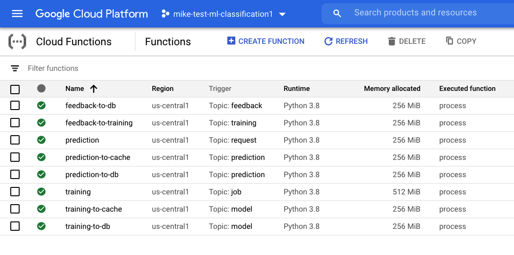
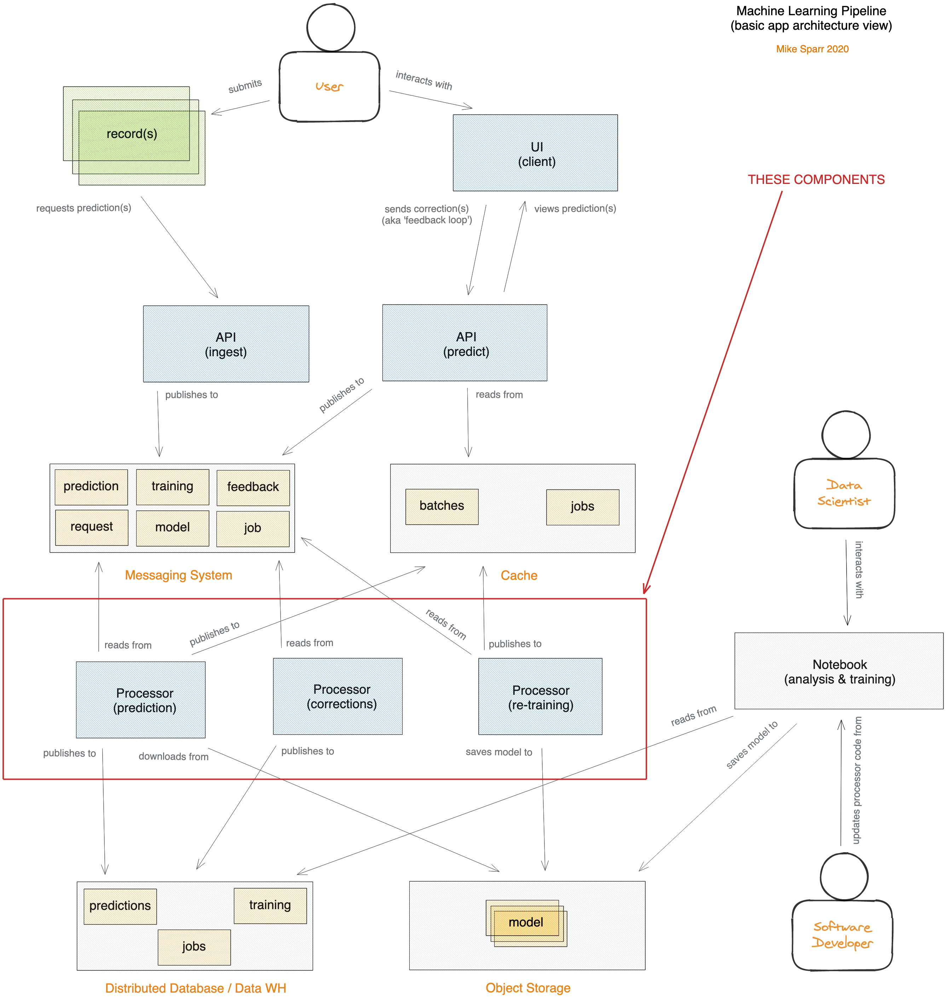
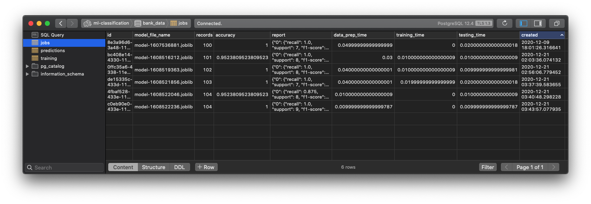
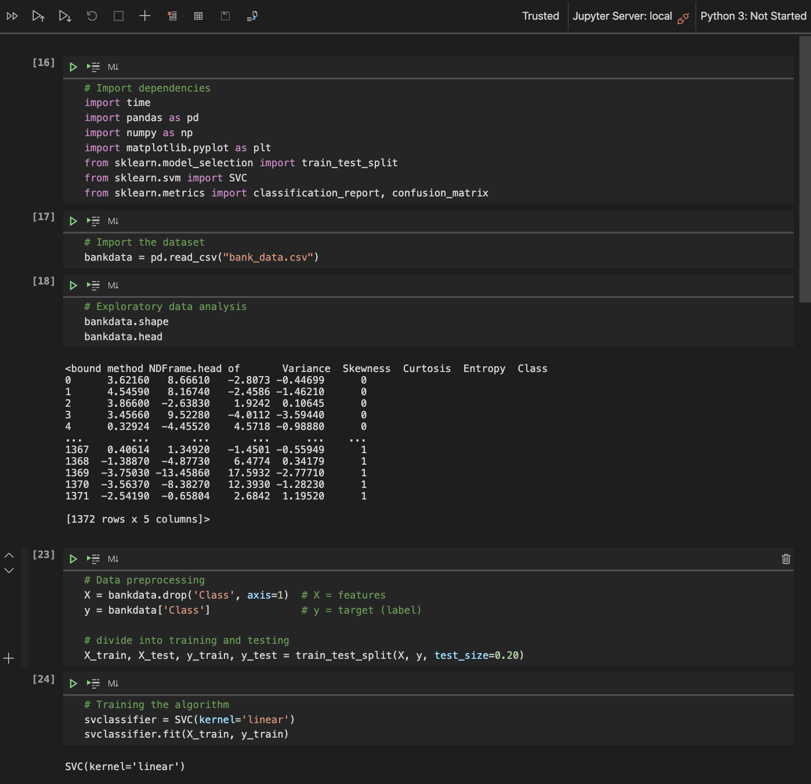

# AI Demo Cloud Functions
These Cloud Functions are triggered by Google Pub/Sub topics for training and serving 
machine learning models with automatic retraining feedback loop. The results can then be viewed 
using the [predict API](https://github.com/mikesparr/ai-demo-predict).

## Secrets
These functions use environment variables and [Google Cloud Secret Manager](https://cloud.google.com/secret-manager) for configuring the functions.

# Demo


# Architecture


# Components
- [Config](https://#) (pending)
- [Web App](https://#) (pending)
- [Ingest API](https://github.com/mikesparr/ai-demo-ingest)
- [Predict API](https://github.com/mikesparr/ai-demo-predict)
- [Processors](https://github.com/mikesparr/ai-demo-functions) (this repo)

# Database
The database design can be found in `schema.sql` file. The plan is to create a separate
repository for configuration, and all infrastructure provisioning will be managed there.



# Training data
This demo ML app is built using the [banknote authentication data set](https://archive.ics.uci.edu/ml/datasets/banknote+authentication) and a copy is saved in file `bank_data.csv`. The database schema is designed
based on this data and it's four features: `variance`,`skewness`,`curtosis`,`entropy`.

# Notebook
I have included the Jupyter Notebook file for the initial training and experimentation. After 
`dumping` the model file, I then took relevant code and applied to the `prediction` and `training` 
Cloud Functions respectively, and then pieced together the rest of the ML Pipeline.



# Prerequisites
You must be familiar with Google Cloud Platform and have the [Google Cloud SDK](https://cloud.google.com/sdk/docs/install) (`gcloud` CLI) installed. 
If you want to recreate the **AI Demo** then you will want an active project with billing enabled.

* NOTE: when you are done remember to **DELETE THE PROJECT** to avoid unneccessary billing.

# Install
```bash
export PROJECT_ID=$(gcloud config get-value project)
export GCP_REGION="us-central1"
export GCP_ZONE="us-central1-a"

export VPC_CONN_NAME="serverless-connector" # created before
export REDIS_INSTANCE="ml-cache1" # created before
export DB_INSTANCE="ml-classification1" # created before
export BUCKET_NAME="mike-test-classification-models1"
export ENV_VAR_FILE="env-vars.yaml"
export SECRET_DB_PASS_KEY="db-pass"

# enable apis
gcloud services enable compute.googleapis.com \
    pubsub.googleapis.com \
    sqladmin.googleapis.com \
    redis.googleapis.com \
    secretmanager.googleapis.com \
    storage.googleapis.com

# clone repo and change to directory
git clone git@github.com:mikesparr/ai-demo-functions.git
cd ai-demo-functions

# create secrets in secret manager
cat > .env << EOF
DBPASS=<your-password-here>
EOF
source .env                             # TODO: local copy of DBPASS=mypass
echo -n $DBPASS | \
    gcloud secrets create $SECRET_DB_PASS_KEY \
        --data-file=- \
        --replication-policy automatic

# fetch redis info
export REDIS_HOST=$(gcloud redis instances describe $REDIS_INSTANCE --region $GCP_REGION --format="value(host)")
export REDIS_PORT=$(gcloud redis instances describe $REDIS_INSTANCE --region $GCP_REGION --format="value(port)")
export AUTH_NETWORK=$(gcloud redis instances describe $REDIS_INSTANCE --region $GCP_REGION --format="value(authorizedNetwork)")
echo "Redis instance at ${REDIS_HOST}:${REDIS_PORT} on network ${AUTH_NETWORK}"

# fetch cloudsql info
export DB_INSTANCE_PRIVATE_IP=$(gcloud sql instances describe $DB_INSTANCE --format="value(ipAddresses[1].ipAddress)")

# create env vars file
cat > $ENV_VAR_FILE << EOF
REDISHOST: $REDIS_HOST
REDISPORT: "6379"
PROJECT_ID: $PROJECT_ID
DBNAME: "bank_data"
DBHOST: $DB_INSTANCE_PRIVATE_IP
DBUSER: "ml_readwrite"
DBPORT: "5432"
BUCKET: $BUCKET_NAME
EOF

# enable functions to access secrets
gcloud secrets add-iam-policy-binding $SECRET_DB_PASS_KEY \
    --role roles/secretmanager.secretAccessor \
    --member serviceAccount:${PROJECT_ID}@appspot.gserviceaccount.com

# create storage bucket
gsutil mb -p $PROJECT_ID -l US-CENTRAL1 -b on gs://$BUCKET_NAME

# create pubsub topics
gcloud pubsub topics create request
gcloud pubsub topics create prediction
gcloud pubsub topics create feedback
gcloud pubsub topics create training
gcloud pubsub topics create job
gcloud pubsub topics create model

# deploy the functions
gcloud functions deploy prediction \
    --runtime python38 \
    --source ./prediction \
    --env-vars-file $ENV_VAR_FILE \
    --vpc-connector $VPC_CONN_NAME \
    --region $GCP_REGION \
    --egress-settings private-ranges-only \
    --entry-point process \
    --memory 256MB \
    --trigger-topic request

gcloud functions deploy prediction-to-cache \
    --runtime python38 \
    --source ./prediction-to-cache \
    --env-vars-file $ENV_VAR_FILE \
    --vpc-connector $VPC_CONN_NAME \
    --region $GCP_REGION \
    --egress-settings private-ranges-only \
    --entry-point process \
    --memory 256MB \
    --trigger-topic prediction

gcloud functions deploy prediction-to-db \
    --runtime python38 \
    --source ./prediction-to-db \
    --env-vars-file $ENV_VAR_FILE \
    --vpc-connector $VPC_CONN_NAME \
    --region $GCP_REGION \
    --egress-settings private-ranges-only \
    --entry-point process \
    --memory 256MB \
    --trigger-topic prediction

gcloud functions deploy feedback-to-db \
    --runtime python38 \
    --source ./feedback-to-db \
    --env-vars-file $ENV_VAR_FILE \
    --vpc-connector $VPC_CONN_NAME \
    --region $GCP_REGION \
    --egress-settings private-ranges-only \
    --entry-point process \
    --memory 256MB \
    --trigger-topic feedback

gcloud functions deploy feedback-to-training \
    --runtime python38 \
    --source ./feedback-to-training \
    --env-vars-file $ENV_VAR_FILE \
    --vpc-connector $VPC_CONN_NAME \
    --region $GCP_REGION \
    --egress-settings private-ranges-only \
    --entry-point process \
    --memory 256MB \
    --trigger-topic training

gcloud functions deploy training \
    --runtime python38 \
    --source ./training \
    --env-vars-file $ENV_VAR_FILE \
    --vpc-connector $VPC_CONN_NAME \
    --region $GCP_REGION \
    --egress-settings private-ranges-only \
    --entry-point process \
    --memory 512MB \
    --trigger-topic job

gcloud functions deploy training-to-cache \
    --runtime python38 \
    --source ./training-to-cache \
    --env-vars-file $ENV_VAR_FILE \
    --vpc-connector $VPC_CONN_NAME \
    --region $GCP_REGION \
    --egress-settings private-ranges-only \
    --entry-point process \
    --memory 256MB \
    --trigger-topic model

gcloud functions deploy training-to-db \
    --runtime python38 \
    --source ./training-to-db \
    --env-vars-file $ENV_VAR_FILE \
    --vpc-connector $VPC_CONN_NAME \
    --region $GCP_REGION \
    --egress-settings private-ranges-only \
    --entry-point process \
    --memory 256MB \
    --trigger-topic model
```

# Other considerations
Although this is only a demo, a few additional features that should be added would be:
- automated tests
- retry logic with exponential backoff
- tracing using [opentracing](https://opentracing.io/)
- messages using [cloudevents](https://cloudevents.io/)

# Contributing
This is just a demo so fork and use at your own discretion.
